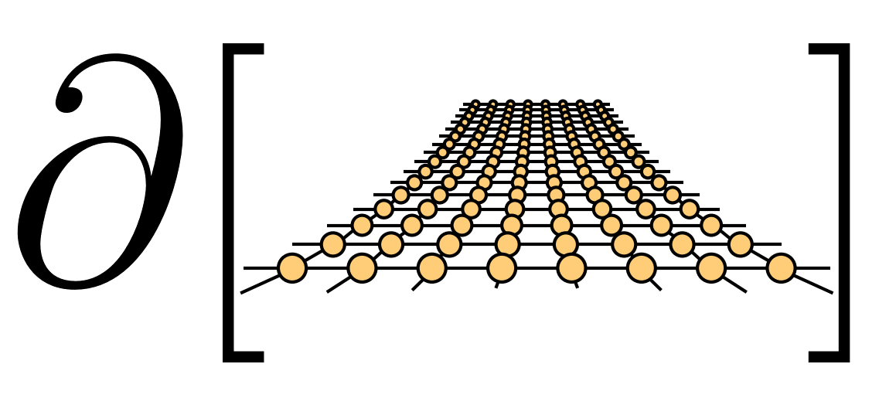
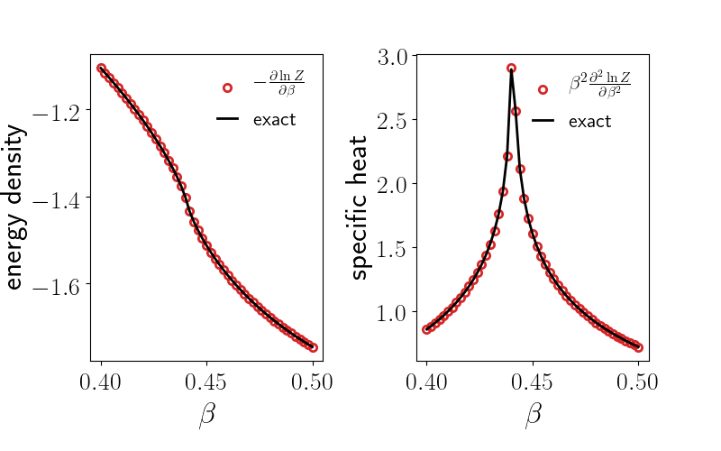
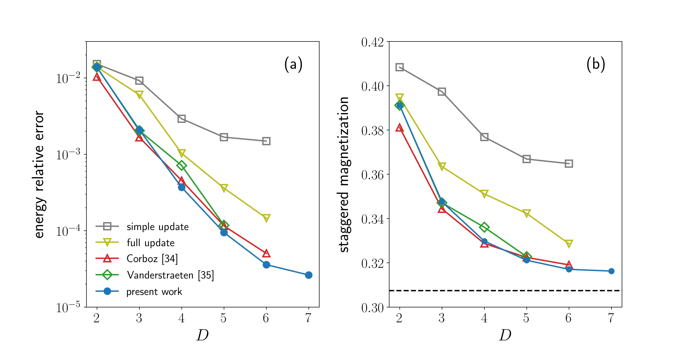

<div align="center">

<h2> Differentiable Programming Tensor Networks </h2>
</div>

[](https://travis-ci.com/tangwei94/tensorgrad)

### Requirements

* [PyTorch 1.0+](https://pytorch.org/)
* A good GPU card if you are inpatient or ambitious 

### Higher order gradient of free energy

Run this to compute the energy and specific heat of the 2D classical Ising model using Automatic Differentiation through the Tensor Renormalization Group contraction. 

```bash
$ cd 1_ising_TRG
$ python ising.py 
```
<p align="center">

</p>

### Variational optimization of iPEPS

Run this to optimize an iPEPS wavefuntion for 2D quantum Heisenberg model. Here, we use Corner Transfer Matrix Renormalization Group for contraction, and L-BFGS for optimization. 


```bash
$ cd 2_variational_iPEPS
$ python variational.py -D 3 -chi 30 
```

You can supply the command line argument `-use_checkpoint` to reduce the memory usage. To make use of the GPU, you can add `-cuda <GPUID>`.  You will reach the state-of-the-art variational energy and staggered magnetization using this code. You can also supply your own Hamiltonian of interest. In case of a question, you can type `python variational.py -h`.

<p align="center">

</p>

### What is under the hood ?

Reverse mode AD computes gradient accurately and efficiently for you! Check the codes in [adlib](https://github.com/wangleiphy/tensorgrad/tree/master/tensornets/adlib) for backward functions which propagate gradients through tensor network contractions. 

### To Cite
```bibtex
@article{PhysRevX.9.031041,
  title = {Differentiable Programming Tensor Networks},
  author = {Liao, Hai-Jun and Liu, Jin-Guo and Wang, Lei and Xiang, Tao},
  journal = {Phys. Rev. X},
  volume = {9},
  issue = {3},
  pages = {031041},
  numpages = {12},
  year = {2019},
  month = {Sep},
  publisher = {American Physical Society},
  doi = {10.1103/PhysRevX.9.031041},
  url = {https://link.aps.org/doi/10.1103/PhysRevX.9.031041}
}
```

### Explore more
https://github.com/under-Peter/TensorNetworkAD.jl

